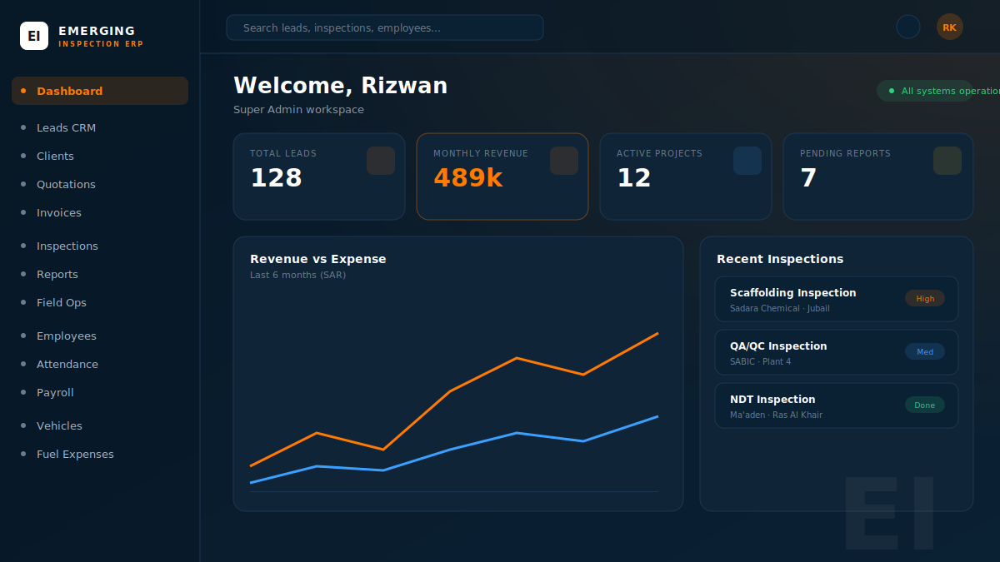

<div align="center">


# Emerging Inspection ERP

### Industrial Inspection ERP · CRM · Payroll · Field Operations

A complete production-grade operations platform for Saudi Arabia / GCC industrial inspection companies — replacing Excel with one professional ERP for inspections, CRM, payroll, fleet and field operations.


</div>

---

## 📸 Preview



> Premium Saudi industrial UI — dark navy `#071827` + safety orange `#FF7A00`, with light/dark theme, GSAP animations and 3D-tilt cards.

---

## ✨ Features

### Core modules
- **Lead CRM** — pipeline, search/filter, AI-assisted emails, WhatsApp click-to-chat
- **Clients · Quotations · Invoices** — full records, auto VAT (15% KSA), PDF generation
- **Inspection Jobs** — scheduling, assignment, checklist, status workflow, GPS/Maps, PDF reports
- **Employees · Attendance · Overtime · Payroll** — auto OT calculation, payslip PDFs
- **Vehicles · Fuel Expenses · Expense Claims** — with approve / reject workflows
- **Projects · Reports · Documents** — centralised operations

### Platform
- 🔐 **Role-based auth** — Super Admin · Owner · Admin · HR · Coordinator · Inspector · Client (each role sees its own panel)
- 👥 **Team management** — owner creates accounts directly and assigns roles
- 📄 **PDF engine** — quotations, invoices, payslips and inspection reports
- 🌗 **Dark / Light theme** · 🎬 **GSAP animations** · 🧊 **3D-tilt cards**
- 📱 **Fully responsive** — mobile drawer navigation, scrollable tables

---

## 🧱 Tech stack

| Layer | Tech |
|-------|------|
| Frontend | Next.js 16 (App Router) · React 19 · TypeScript |
| Styling | Tailwind CSS v4 · shadcn-style UI (Radix) · GSAP |
| Forms | React Hook Form · Zod |
| Backend | Supabase — PostgreSQL · Auth · Storage |
| PDF | @react-pdf/renderer |
| Hosting | Vercel |

---

## 🚀 Getting started

```bash
# 1. install
npm install

# 2. environment — copy and fill in your Supabase keys
cp .env.example .env.local

# 3. run
npm run dev   # http://localhost:3000
```

### Environment variables (`.env.local`)

```env
NEXT_PUBLIC_SUPABASE_URL=https://<your-project>.supabase.co
NEXT_PUBLIC_SUPABASE_ANON_KEY=sb_publishable_xxx
SUPABASE_SERVICE_ROLE_KEY=eyJ...        # server-only, for admin/team-member creation
OWNER_EMAIL=owner@yourcompany.com       # auto-promoted to super_admin on first login
```

### Database

Run the SQL in the Supabase SQL editor, in order:

1. `supabase/schema.sql` — tables, enums, indexes
2. `supabase/policies.sql` — Row Level Security
3. `supabase/seed.sql` — optional demo data

---

## 👥 Roles & panels

| Role | Sees |
|------|------|
| **Super Admin / Owner** | Everything |
| **Admin** | Sales, operations, fleet, finance |
| **HR** | Employees, attendance, overtime, payroll |
| **Coordinator** | Inspections, reports, OT & fuel approval |
| **Inspector** | Assigned jobs, checklist, photos, fuel claims |
| **Client** | Their reports, projects and invoices |

Team members are created from **Users & Roles → Add Team Member** with a role; they log in and see only their panel.

---

## 📁 Structure

```
src/
  app/(auth)/login          # split-screen login
  app/(app)/...             # dashboard + all modules
  app/api/pdf · api/ai      # PDF generation, Claude AI
  components/ui · common · layout · ...
  lib/  supabase · actions · validations · data · pdf
supabase/  schema.sql · policies.sql · seed.sql
```

---

## ☁️ Deploy to Vercel

1. Push this repo to GitHub
2. Import the repo at [vercel.com/new](https://vercel.com/new)
3. Add the environment variables above
4. Deploy — every push to `main` auto-deploys

---

<div align="center">

Built for the Saudi / GCC industrial inspection market · SAR currency · 15% KSA VAT · Asia/Riyadh

</div>
